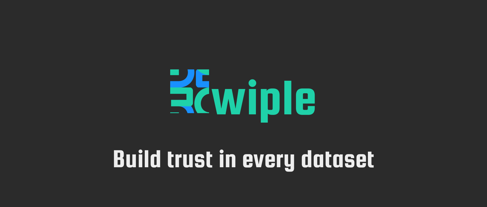

# Welcome

Welcome to Swiple! 🚀

### What is Swiple?
Swiple is an automated data monitoring platform that helps analytics and data engineering teams seamlessly monitor the quality of their data.
With automated data analysis and profiling, scheduling and alerting, teams can resolve data quality issues before they impact mission critical resources.

### Features
* 📈 Measure the data quality of a **SQL query**, **table**, or **view**.
* 🏗 Generate data expectations using **Automated Data Profiling**.
* 🕑 **Schedule** validations to run on any recurrence interval.
* 📄 **Automated Data Docs**
* 🫡 Add **Objectives / SLA's** for your data.
* 🔔 Get **notified** when the quality of your data changes.

### Supported Databases

### Authentication
* Username/Password
* OAuth
  * Github
  * Google
  * Microsoft
  * Okta

### Notifications
* Email
* Slack
* Microsoft Teams
* OpsGenie
* PagerDuty

### Get started in 4 commands
* #### [Quickstart With Docker Compose](https://swiple.io/docs/getting-started/quick-start)
* #### [Start Developing Locally](https://swiple.io/docs/getting-started/start-developing)

## Licensing
Source code in this repository is covered by the Elastic License 2.0.